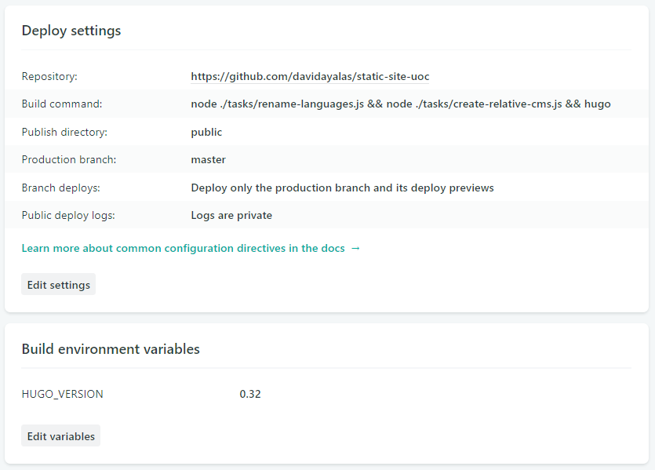
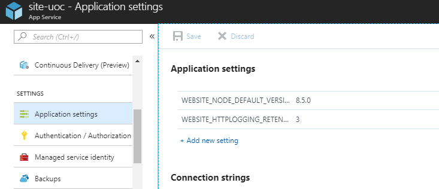
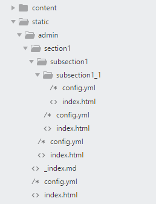

# Hugo + NetlifyCMS = HugolifyCMS

This tutorial demonstrates how to integrate Hugo generated site and Netlify CMS, with N levels (nested sections/folders). It is easily exportable to other [SSG](https://www.staticgen.com/)

Repo: https://github.com/davidayalas/static-site-uoc/

### Contents 

- [Live demo](#live-demo)
- [Features](#features)
- [Motivation](#motivation)
- [Setup](#setup)
	- [Netlify setup](#netlify-setup)
	- [Azure setup](#azure-setup)
- [Key files to setup this strategy](#key-files-to-setup-this-strategy)
- [Sections explained](#sections-explained)

### Live demo

* Home: https://site-uoc.netlify.com/en/?cms=true (see the footer)
* Section: https://site-uoc.netlify.com/en/section1/?cms=true
* Page at 1st level section: https://site-uoc.netlify.com/en/section1/page1/?cms=true
* Nested section: https://site-uoc.netlify.com/en/section1/subsection1/?cms=true
* Page in nested section: https://site-uoc.netlify.com/en/section1/subsection1/page1/?cms=true

## Features

* Hugo with nested folders integrated with NetlifyCMS
* Multilanguage (Netlifycms and Hugo support for multilanguage are incompatibles by now) 
* CMS accessible from live site
* It works with Netlify Identity and Github Auth:  main problem here was creating new sections paths in content folder.

## Motivation

* Hugo is great to manage static sites
* Netlify CMS is an amazing and easy to use CMS in front of static site generators (and awesome if you deploy your web to Netlify)
* If your Hugo site has a structure based on nested folders, is OK from Hugo side but difficult from Netlify CMS. 
* This strategy will help you to manage both, and from your live site, access to NetlifyCMS administration only for the current section you are visiting (content folder from Hugo). This simplifies the lookup for content, because you access it from your live site and then you edit it.

## Setup

Fork the project from github interface https://github.com/davidayalas/static-site-uoc

or

		$ git clone https://github.com/davidayalas/static-site-uoc
		$ ... SETUP YOUR OWN REPO

(OPTIONAL) if you want to build the repo locally, you need to execute from your repo root

		$ node tasks/rename-languages.js 
		$ hugo

When you publish to your repo, rename content files to {{filename}}-{{language}}.md

		$ node ./tasks/rename-languages.js -

Then

		$ git add -A
		$ git commit -m "new version"		
		$ git push

### Netlify setup

(change the url with your own repo)

1. Build command:

		$ node ./tasks/rename-languages.js && node ./tasks/create-relative-cms.js && hugo

	

2. Setup Netlify Identity

3. Setup Netlify Git Gateway

### Azure setup

1. Setup your application in a free tier
2. Setup an environment variable for NodeJS version 8.5.0 (minimum version, to use nodejs to rename languages and relative cms)

Files:

- [.deployment](https://github.com/davidayalas/static-site-uoc/blob/master/.deployment)
- [azure-deploy.cmd](https://github.com/davidayalas/static-site-uoc/blob/master/azure-deploy.cmd)
- More info: http://www.nobadmemories.com/blog/2017/05/blogging-with-hugo-and-azure/

## Key files to setup this strategy

* **Nodejs** files to help the build process:

	- **Rename languages**: [rename-languages.js](https://github.com/davidayalas/static-site-uoc/blob/master/tasks/rename-languages.js)
		- it changes between Hugo and Netlify language management (in fact, Netlify doesn't manage languages in filenames)
		- when you build to store in git, you need to set filenames to {{filename}}-{{language}}.md
		- when you build to generate HTML, you need to set filenames to {{filename}}.{{language}}.md

	- Create **relative CMS** to content/section: [create-relative-cms.js](https://github.com/davidayalas/static-site-uoc/blob/master/tasks/create-relative-cms.js)
		- it loops over ./content folder and creates relative "admin cms" to each section, copying [static/admin/index.html](https://github.com/davidayalas/static-site-uoc/blob/master/static/admin/index.html) and [static/admin/relative.yml](https://github.com/davidayalas/static-site-uoc/blob/master/static/admin/relative.yml) (as config.yml), replacing {{folder}} in [relative.yml](https://github.com/davidayalas/static-site-uoc/blob/master/static/admin/relative.yml)

			

			- then, you can access admin a section through you live site navigating to https://yoursite.com/admin/section1/subsection1/subsubsection1_1/

		- when you build to store in git, you need to set filenames to {{filename}}-{{language}}.md
		- when you build to generate HTML, you need to set filenames to {{filename}}.{{language}}.md

* CMS in the footer of the live site:

	* **Hugo partial template for CMS**
		* [cms.html](https://github.com/davidayalas/static-site-uoc/blob/master/themes/web-uoc-1/layouts/partials/cms.html)
		* it adds links to login (netlify identity), create new sections, new pages, edit pages, ...
		* this template is only visible if param cms=true is attached to the url.

			

	* Static file [cms.js](https://github.com/davidayalas/static-site-uoc/blob/master/themes/web-uoc-1/static/js/cms.js) to manage visibility and "create section" directly to git
		* It push a version of [static/admin/_index.md](https://github.com/davidayalas/static-site-uoc/blob/master/static/admin/_index.md) to git for every of your configured languages. You can setup your frontmatter accordingly to your content type in config.yml

* There are two "instances" of Netlify CMS:
	* Usual [static/admin/config.yml](https://github.com/davidayalas/static-site-uoc/tree/master/static/admin/config.yml), recommended to manage home staff
	* [static/admin/relative.yml](https://github.com/davidayalas/static-site-uoc/tree/master/static/admin/relative.yml) to manage the content related with a section
	* **NOTE for Github Custom Auth**: in both [static/admin/config.yml](https://github.com/davidayalas/static-site-uoc/tree/master/static/admin/config.yml) and [static/admin/relative.yml](https://github.com/davidayalas/static-site-uoc/tree/master/static/admin/relative.yml) is important to setup a **client_id key** with your github application id.

## Sections explained

It's not possible (April 2018) to create a new path in github from Netlify CMS. It's not possible setup config.yml "folder" with a dynamic value from files, or in case you put a variable in the slug (e.g slug: /{{folder}}/filaname.md) it gets sanitized and folder isn't created.

Then, the best way now is to access directly to github. This is done through Netlify Git Gateway (easy way) or through Git Auth Workflow. All the staff is in [cms.js](https://github.com/davidayalas/static-site-uoc/blob/master/themes/web-uoc-1/static/js/cms.js) and it can be improved :)

Github Auth is the easiest way to deploy sites outside netlify, you only need a custom auth app like these: https://www.netlifycms.org/docs/authentication-backends/.

Hard way is with Netlify Git Gateway and Gotrue, but is better because users can access to limited resources and they don't need a Github account
